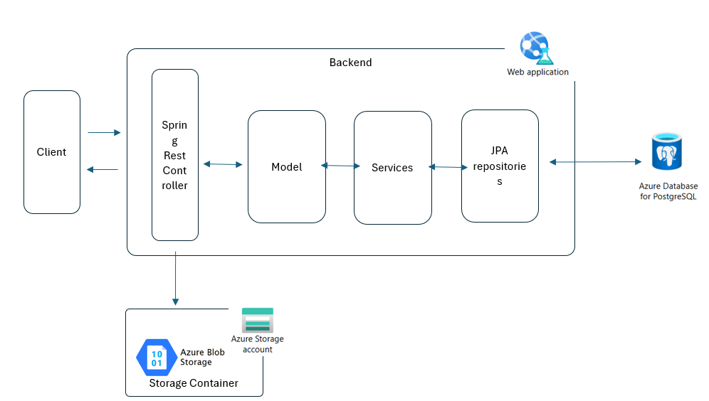
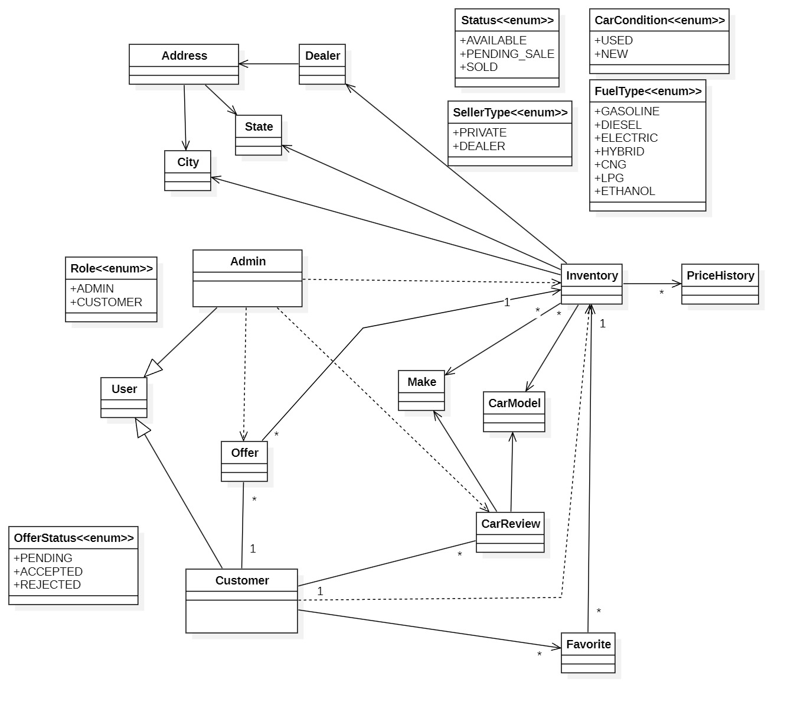
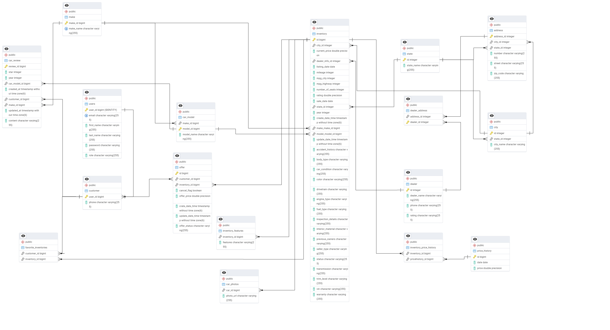
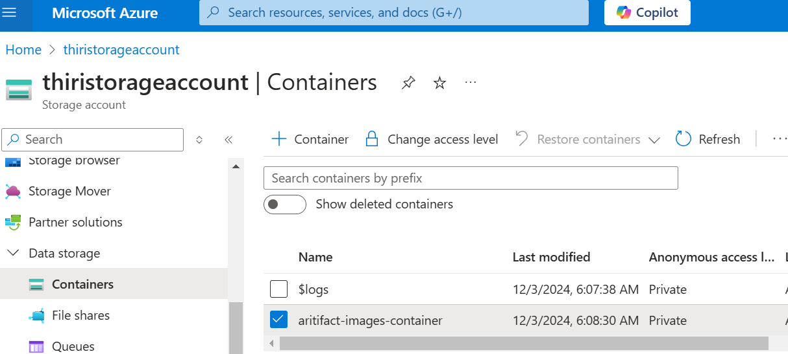
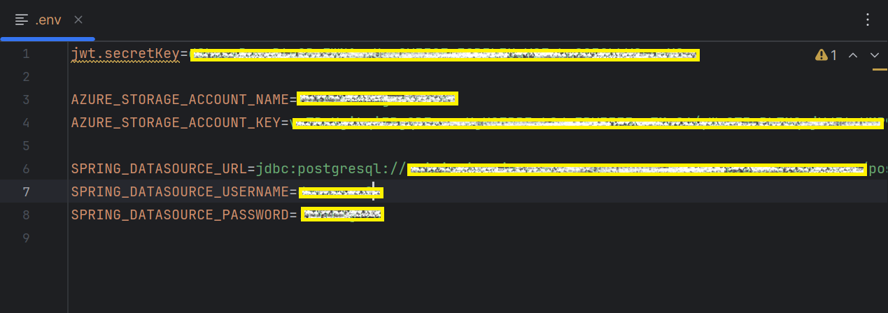
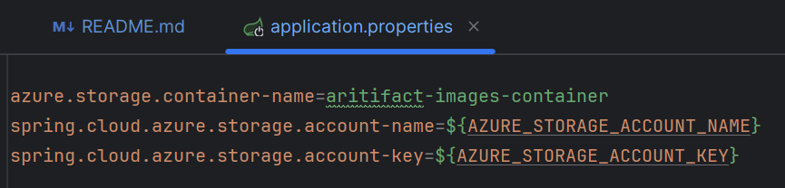

# DriveWise Car Dealership System (Author : Thiri Mon, ID: 616932)
## Problem Statement:
The current manual car dealership system is limited by its dependency on office hours and in-person interactions. This creates obstacles for customers who must visit the dealership to buy cars, often during restricted business hours. As demand for convenience and accessibility increases, there is a need for a digital solution to enhance customer experience and operational efficiency.

## Solution of the Problem:
The Online Car Dealership System will provide a comprehensive digital platform that offers essential features for customers and admin staff, addressing the limitations of the current manual system.

## Actors
- Administrators: A user who manages car listings and customer's offer list.
- Customer: A user who registers on the platform, browses car listings, save their favorite, write the reviews and offer the cars they want

## Functional Requirements
### Core Features
1. User Registration
   - System allows users to create an account by providing necessary details such as first name, last name, email, password.
     
2. Car Inventory
   - **Register**: System allows administrators to register detailed description of each car, based on its specifications like make, model, year, trim level.
   - **Search**: System allows users to filter cars by criteria such as make, model, year, price, mileage. 
   - **Display**: System shows detailed listings for each car, including specifications like general info(make, model, year, trim level), specific info (price, miles, body style, engine, VIN, transmission, exterior, interior, doors, fuel type, condition)
   - **Update**: System allows administrators to update car specification if needed.
   - **Delete**: System allows administrators to delete car. It allows only the car has 'available' status(means no one offer it).

3. Favorites
   - **Create**: System allows customers to save their favorite cars.
   - **Search**: System allows customers to find their favorite cars list.
   - **Update**: System allows customers to add the cars to their favorite list.
   - **Delete**: System allows customers to remove the cars from their favorite list.

4. Drive Reviews
   - **Create**: System allows customers to write review based on car brand, model and year.
   - **Search**: System allows customers to find their reviews. Allow administrator to find all reviews and based on filter such as make, model, year.
   - **Update**: System allows customers to update their reviews and partially as well.
   - **Delete**: System allows customers to delete their reviews.
  
5. Offers
   - **Create**: System allows customers to offer the car they want with their negotiate price. 
                 System provide request information template to place order for each specific car. Customer can offer only the car inventory status 'AVAILABLE' (Meaning: The car is in stock, ready for purchase, and has no ongoing sale processes.). (system will save PENDING offer status)
   - **Search**: System allows customers to find their offers. Allow administrator to find all offers, offers by user and by inventory, offer by specific offer id.
   - **Update**: System allows administrator to manage offer like ACCEPT, REJECT, CANCEL PENDING SALE, FINALIZE SALE.
     - ACCEPT: An offer can be accepted if the inventory status is 'AVAILABLE.' When an offer is accepted, the car's inventory status will change to 'PENDING_SALE' (Meaning: A customer has expressed interest, and the car is in the sales process, but financing has not yet been finalized).
     - REJECT: An offer can be rejected if the offer status is 'ACCEPTED' and the car's inventory status is 'PENDING_SALE.' When an offer is rejected, the car's inventory status will revert to 'AVAILABLE.'
     - CANCEL PENDING SALE: A pending sale offer can be canceled if the offer status is 'ACCEPTED' and the car's inventory status is 'PENDING_SALE.' When a pending sale offer is canceled, the car's inventory status will revert to 'AVAILABLE.'
     - FINALIZE SALE: A pending sale offer can be finalized. Once financing is complete, the car inventory's status is changed to 'SOLD' (Meaning: The car has been sold, and ownership is transferred to the buyer.). The remaining offers for that car will be rejected.
   - **Delete**: System allows customers to cancel their offers. (only if the offer status 'PENDING').
  
## Non-Functional Requirements
  - **Security**: Implement secure authentication and authorization protocols to protect data.
  - **Usability**: Provide clear instructions and guidance throughout the browsing, registration, and transaction processes to ensure a smooth user experience.
  - **Reliability**: System is accessible 24/7, allowing customers to browse and make inquiries or reservations at any time.
  - **Scalability**: System handle an increasing number of users, car listings, and transactions as the dealership grows.
  - **CI/CD pipeline**: System automate the build, testing, and deployment processes using GitHub Actions tool for seamless integration and delivery of updates.
  - **Deploy in Cloud**: System utilize Azure cloud platform for hosting, leveraging their scalability, reliability, and ease of deployment features.

## Application Architecture

## Use Case Diagram

## Class Diagram

## ER Diagram

## Project's Setup Instruction
- Prerequisites
    - JDK : 21 (Verify installing by running 'java -version')
    - Ensure Apache Maven is installed for dependency management. (Verify installing by running 'mvn -version')
    - Database : PostgreSQL (optional)(if you use docker or azure, you don't need to install)
    - IDE : Ensure it supports Spring Boot and Maven.
    - Git : Install Git to clone the project repository.
- Steps to Set Up the Project
    1. Clone repository
        - git clone <repository_url>
        - cd <project_folder>
    2. Create azure storage blob
        - 
    3. Create .env file in project directory
        - set up your jwt key, azure storage account name and key, database url, name, password
        - 
    4. Change your Azure Storage container name in application.properties
        - 
    5. Run the application
        - run application using your IDE.
        - Alternatively, build a jar and run it.
            - mvn clean package
            - java -jar target/<application-name>.jar
            - (optionally, you may need to set up environment variable if you run with jar)
    6. Access the application
        - http://localhost:8080
## Here is the video link for CI/CD evidence

